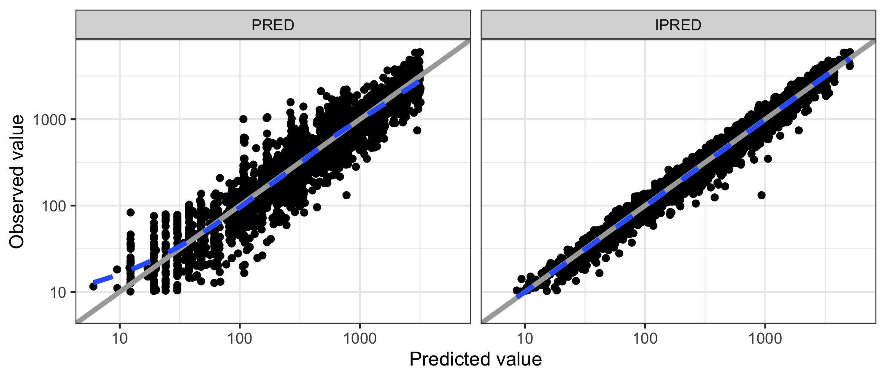
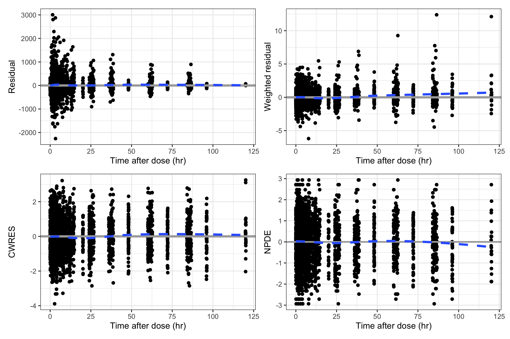
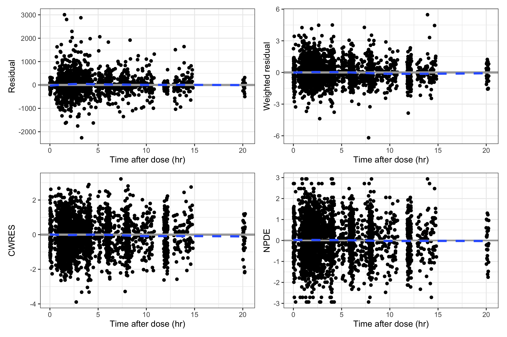
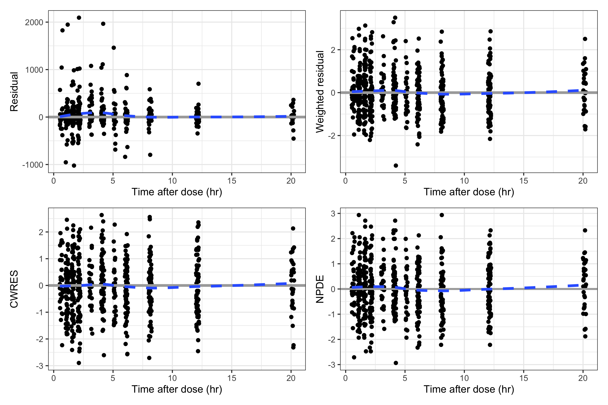
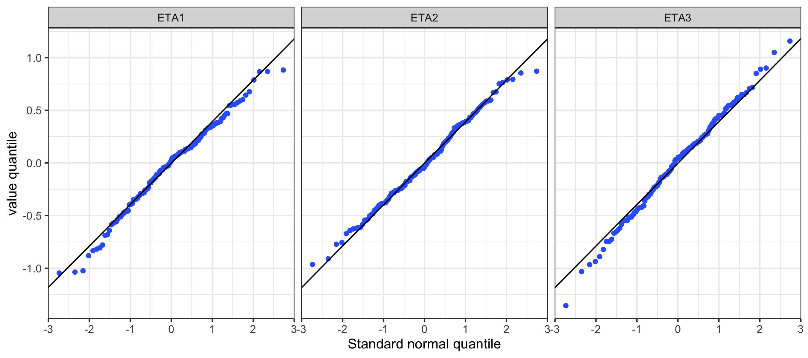
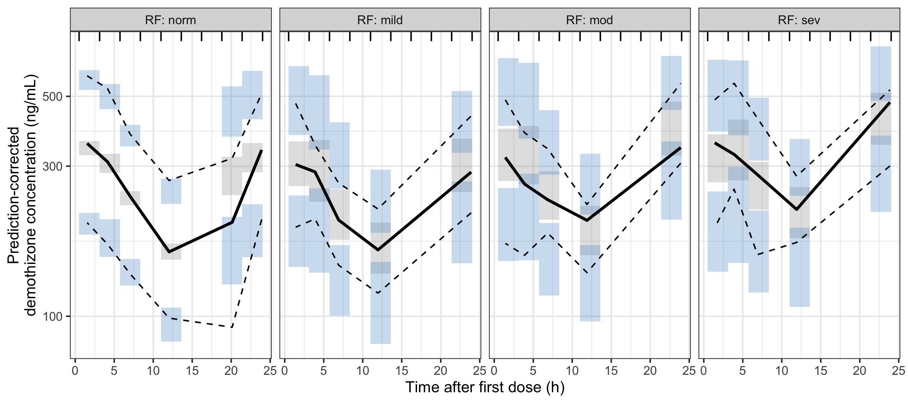

## Model Evaluation

- Descriptive: how well did I describe the data set I have?
- Predictive: how will this model do for predicting new data?

- Help decide what to try next in modeling
- Help create a "case" for the final model
  - Multifaceted
  - Consider totality of evidence
- Make your "case" for
  - You, the modeler
  - Others, consumers of the model

## DV vs PRED/IPRED - Base model

{fig-align="center"}

## DV vs PRED/IPRED - Base model, log scale

{fig-align="center"}

## DV~PRED/IPRED - Base, by Renal Function Group

{fig-align="center"}

##  DV~PRED/IPRED - Final, by Renal Function Group

{fig-align="center"}

## Residuals versus TIME

{fig-align="center"}

## Residuals {style="margin-top: -30px; font-size: 0.8em;"}

**Residuals (RES)**

$$\mathrm{RES}_\mathrm{ij} = \mathrm{DV}_\mathrm{ij} - \mathrm{PRED}_\mathrm{ij}$$

**Weighted Residuals (WRES)**

$$\mathrm{WRES}_\mathrm{ij} = \frac{DV_\mathrm{ij} - \mathrm{PRED}_\mathrm{ij}}{\sqrt{Var(\mathrm{DV}_\mathrm{ij})}} = \frac{\mathrm{RES}_\mathrm{ij}}{\sqrt{Var(\mathrm{DV}_\mathrm{ij})}}$$

**Conditional Weighted Residuals (CWRES)**

$$\mathrm{CWRES}_\mathrm{ij} = \frac{\mathrm{DV}_\mathrm{ij} - \mathrm{EPRED}_\mathrm{ij}}{\sqrt{Var(\mathrm{DV}_\mathrm{ij} \mid \hat{\eta}_i)}}$$

Where $i$ indexes the individual, $j$ indexes the observation within individual $i$,
and $\hat{\eta}_i$ are the empirical Bayes estimates of the random effects for individual $i$.

**Expected Prediction (EPRED)**

$$\mathrm{EPRED}_\mathrm{ij} = f(x_\mathrm{ij}, \theta, \hat{\eta}_i)$$

Where $f$ is the structural model, $x_{ij}$ is the design vector for individual $i$ observation $j$,
$\theta$ are the fixed-effect parameters, and $\hat{\eta}_i$ are the empirical Bayes estimates for individual $i$.

## Normalized prediction distribution errors (NPDE)  {.compact}

**Simulate from the model**

$$DV_\mathrm{ij}^{(k)} \sim f(x_\mathrm{ij}, \theta, \eta_i^{(k)}, \epsilon_\mathrm{ij}^{(k)}), \quad k = 1, \dots, K$$

**Compute the predictive CDF for each observation**

$$\mathrm{pde}_\mathrm{ij} = \frac{1}{K} \sum_{k=1}^{K} \mathbf{I}\left(DV_\mathrm{ij}^{(k)} \leq DV_\mathrm{ij}\right)$$

$$\text{(when calculated with decorrelated data.)}$$

**Normalize**
$$\mathrm{NPDE}_\mathrm{ij} = \Phi^{-1}(p_\mathrm{ij})$$

**Under a correctly specified model**

$$\mathrm{pde}_{ij} \sim \operatorname{U}(0, 1)$$

$$\mathrm{NPDE}_\mathrm{ij} \sim \operatorname{N}(0, 1)$$

**Limits on NPDE**

- NONMEM limts $\mathrm{pde}_\mathrm{ij}$ to be  $>$ 0 and $<$ 1 (strictly)
- NPDE cannot be beyond $\pm$ 3.29.

## Residuals versus Time After Dose

{fig-align="center"}

## Residuals versus TAD - first 24 hours

{fig-align="center"}

## Residuals versus TAD - first 24 hours, SAD

{fig-align="center"}

## Residuals versus PRED

{fig-align="center"}

## NPDE distrbution

{fig-align="center"}

## NPDE non-normal

{fig-align="center"}

## NPDE covariate

{fig-align="center"}

## NPDE covariate base model

{fig-align="center"}

## ETA histogram

{fig-align="center"}

## ETA Q-Q plot

{fig-align="center"}

## ETA covariates   {style="margin-top: -30px; font-size: 0.8em;"}

{fig-align="center"}

## ETA  pairs

{fig-align="center"}

## Out of the box VPC {style="font-size: 0.8em;"}

::: {.columns}

::: {.column width="45%"}

- Observed data
  - Observed data points
  - Observed median
  - Observed 5th and 95th percentiles

- Simulated data
  - Simulated median
  - Simulated 5th and 95th percentiles

::: {.callout-tip title="What questions do VPCs answer?"}
* Are data simulated from the model similar to our observed data?

* Could our model have generated the data we observed in our study?

:::{style="border-top: 1px solid #ccc; margin: 0.5em 0;"}
:::

- Memorize
- Be prepared to explain predictive checks to people in a single sentence

:::

:::

::: {.column width="55%"}

{fig-align="center" width="80%"}

:::

:::

## (Visual) predictive check steps {style="font-size: 0.9em;"}

::: {.columns}

::: {.column width="55%"}

1. Fit a model to a data set
2. Using the _same_ data design, simulate replicate outcomes (PK) from the model
    a. Same people
    b. Same dosing
    c. Same observation times
3. Calculate statistics on simulated and observed data
    a. Single number for observed (N = 1)
    b. Replicate numbers for simulated (N = 500 or 1,000)
    c. Requires "bins" for VPC
4. Compare observed data statistic (singular) with the distribution of simulated statistics (plural)

:::

::: {.column width="45%"}

::: {.callout-note title="Always remember:"}
Handle the replicate simulated data in the 

- Exact.   

- Same.    

- Way.   

that you handle the observed data.

:::{style="border-top: 1px solid #ccc; margin: 0.5em 0;"}
:::

Special considerations: 

- Titrated doses
- Dropout
- BLQ

:::

:::
:::

## VPC showing bins

{fig-align="center"}

## VPC dropping observed data points

{fig-align="center"}

## VPC different bins

{fig-align="center"}

## Prediction-corrected VPC

Observed and simulated values are scaled by the ratio of the typical population 
prediction at the median independent variable value within each bin to the 
typical prediction for that individual observation:

$$\mathrm{pcDV}_\mathrm{ij} = \mathrm{DV}_\mathrm{ij} \times \frac{\mathrm{PRED}_\mathrm{bin}}{\mathrm{PRED}_\mathrm{ij}}$$

$$\mathrm{pcDV}_\mathrm{ij}^{(k)} = DV_\mathrm{ij}^{(k)} \times \frac{PRED_\mathrm{bin}}{PRED_\mathrm{ij}^{(k)}}$$

- Allows you to group data with different expected values (e.g., group subjects getting very different dodse)
- Needs PRED from NONMEM; be sure to carry that into the data set you are using to simulate / summarize the VPC

## Pred-corrected VPC by Renal Impairment Group

{fig-align="center"}

## Landmark predcheck - histogram

{fig-align="center"}

## Landmark predcheck - QQ

{fig-align="center"}

## Diagnostics and predictive checks in model development

- Start creating both GOF and VPC early; don't wait till your final model
- Use them to help guide model development decisions
  - Contrast with "I want to show that this is the right model"
- Predictive checks show you where the model does well and where it doesn't
  - Predictive checks (VPC) won't be perfect
  - You might not be able to "fix" every imperfection
- Model selection should consider both diagnostics and pred checks
  - It can frequently be difficult to decide
  - I would "prefer" predictive checks among the evidence base

## References

- Dykstra K, Mehrotra N, Tornøe CW, et al. (2015) Reporting guidelines for population pharmacokinetic analyses. Journal of pharmacokinetics and pharmacodynamics 42(3): 301–314.

- Byon W, Smith MK, Chan P, et al. (2013) Establishing best practices and guidance in population modeling: an experience with an internal population pharmacokinetic analysis guidance. CPT: pharmacometrics & systems pharmacology 2: e51.

- Population Pharmacokinetics Guidance for Industry February 2022
  - <https://www.fda.gov/regulatory-information/search-fda-guidance-documents/population-pharmacokinetics>

