# The problem[^1]

[^1]: Kristjansdottir, Kolbrun et al., 2012

::: columns
::: {.column width="50%"}
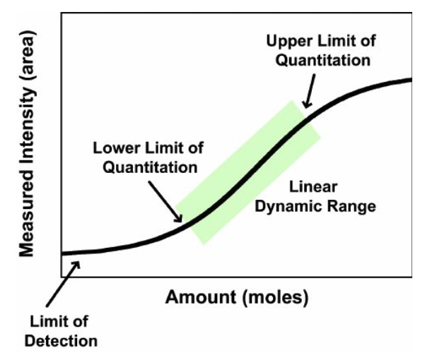
:::

::: {.column width="50%"}
-   The signal intensity of bioanalytical assay should be proportional to the amounts in the sample.

-   However, this relationship is only linear over a certain range.

-   The lower and upper boundaries of the range are refer to as:

    -   Lower limit of quantification (LLOQ).

    -   Upper limit of quantification (ULOQ).
:::
:::

# Below limit of quantification (BLQ)

## LLOQ definition[^2] {style="font-size: 1em"}

[^2]: Bioanalytical Method Validation, FDA Guidance, 2018

-   The LLOQ is the lowest amount of an analyte that can be quantitatively determined with acceptable precision and accuracy.
    -   Precision: coefficient of variation (CV%) 20-25% depends on assay.
    -   Accuracy: 20-25% depends on assay.
-   The analyte response at the LLOQ should be $\geq$ five times the analyte response of the zero calibrator.

## BLQ

-   Also referred as below quantification limit (BQL).
-   BLQ is also known as left-censoring.

```{r}
#| warning: false
suppressPackageStartupMessages(library(tidyverse))
suppressPackageStartupMessages(library(patchwork))
theme_set(theme_bw())

data <- data.frame(conc=rnorm(n=1000, mean=10, sd=5)) %>% 
  mutate(conc2=ifelse(conc>1, conc, NA_real_)) 

p1 <- ggplot(data)+geom_histogram(aes(x=conc), bins=30, alpha=0, color="black")+
  xlab("Concentrations")+ylab("Density")+ggtitle("Within LQ")
p2 <- ggplot(data)+geom_histogram(aes(x=conc2), bins=30, alpha=0, color="black")+
  xlab("Concentrations")+ylab("Density")+ggtitle("BLQ")
p1+p2
```

-   BLQ is an indicator/flag type of variable, for example:
    -   BLQ=0, if a concentration $\geq$ LLOQ.
    -   BLQ=1, if a concentration $\lt$ LLOQ.

## Why BLQ can be a problem in popPK analyses

-   Bias parameter estimates.
-   Inappropriate model selections.
-   Ignoring BLQ concentrations potentially discard useful information, albeit the information is somewhat compromised.
    -   Unreliable measurements.
    -   Only know a measurement is below a certain level.
-   Complicated model evaluations
    -   Diagnostic plots
        -   Depends on BLQ handling methods, residuals or predictions may not be available for BLQ measurements.
        -   Simulation-based diagnostics, such as NPDE, provide unique values.
    -   Additional predictive checks (e.g., fraction of BLQ)

# Methods to handle BLQ

## How to handle BLQ in a popPK analysis[^3] {style="font-size: 1em"}

[^3]: Stuart L. Beal, JPKPD, 2001

-   M1: Ignore BLQ measurements, parameter estimated assuming a full distribution.

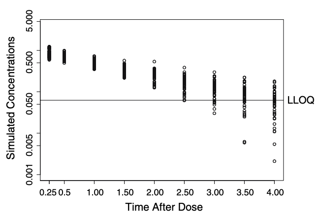{width="50%"}

## How to handle BLQ in a popPK analysis[^4] {style="font-size: 1em"}

[^4]: Stuart L. Beal, JPKPD, 2001

Likelihood methods:

-   Ignore BLQ measurements:

    -   M2: Conditioning the likelihood of all measurable concentrations $\gt$ LLOQ.

-   Include BLQ measurements:

    -   M3:

        -   Above LQ: Treat as a continuous outcome, maximize the likelihood.

        -   Below LQ: Treat as a categorical outcome, maximize the probability $\lt$ LLOQ.

    -   M4:

        -   Above LQ: Same as M3.

        -   Below LQ: Similar to M3, but maximize the probability $\lt$ LLOQ, but also $\gt$ 0.

## How to handle BLQ in a popPK analysis[^5] {style="font-size: 1em"}

[^5]: Stuart L. Beal, JPKPD, 2001

Imputation methods:

-   M5: Impute BLQ measurements as LLOQ/2.

-   M6: Impute only the first BLQ measurement as LLOQ/2, ignore the rest, in a sequence of an individual profile.

-   M7: Impute BLQ measurements as 0.

## General consensus

-   When %BLQ is low (e.g., $\lt$ 5%).
    -   In theory, OK to ignore.
    -   In reality, someone has to consider:
        -   Model structure
        -   If the position of BLQ measurement is critical given a model structure.
-   When %BLQ is moderate to high (e.g., $\gt$ 10%), or the position of BLQ measurements is critical with respect to a model.
    -   M3 is the optimal way, but requires **the recorded timings of BLQ measurements**.
        -   M4 is similar to M3, but more complex statistics with minimum gain in most of the situations.
    -   M2 is the optimal option when **timings of BLQ measurements time are not available**.
    -   M5 and M6 may be useful depends on the situation.
    -   M1 and M7 can have the most bias.
-   M7 can cause model instability regardless of %BLQ.

## Consequencies of an inappropriate handling of BLQ: Bias parameter estimates[^6]

[^6]: Jae Eun Ahn, et al., JPKPD, 2008

::: columns
::: {.column width="50%"}
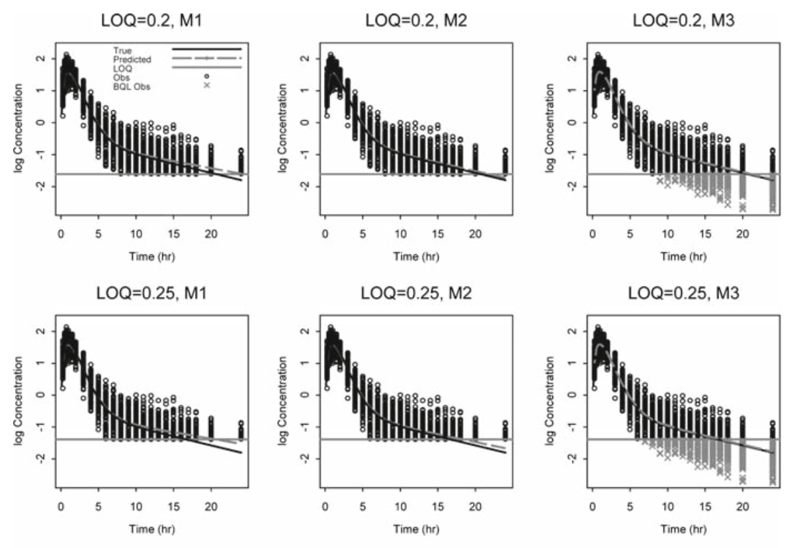{width="100%"}
:::

::: {.column width="50%"}
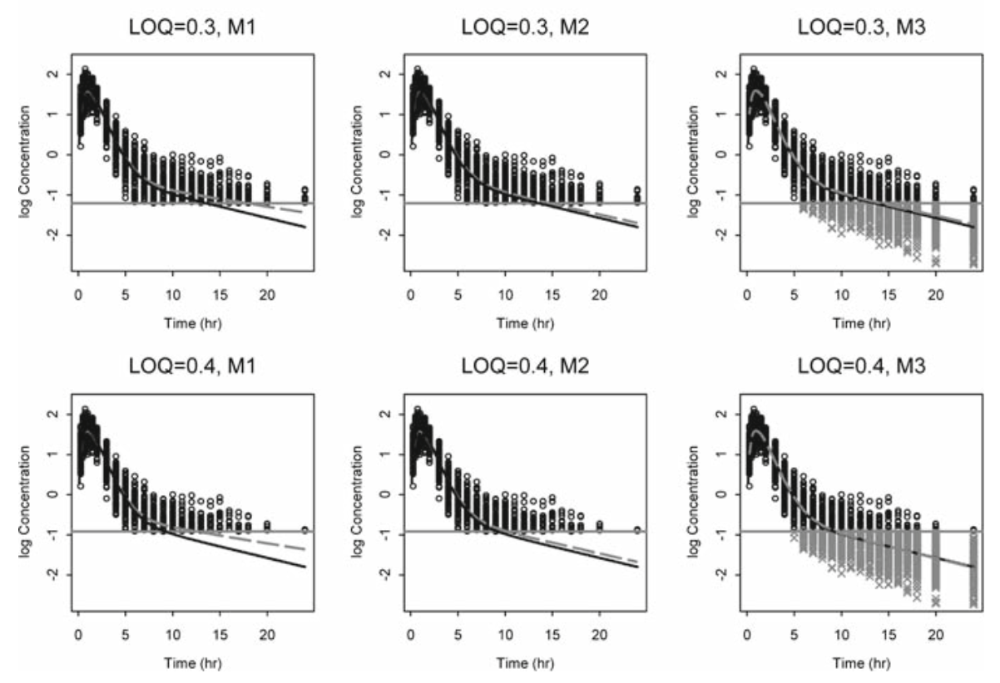{width="100%"}
:::
:::

## Consequencies of an inappropriate handling of BLQ: Bias parameter estimates[^7].

[^7]: Ron J. Keizer, et al., Pharmacology Research & Prospective, 2015

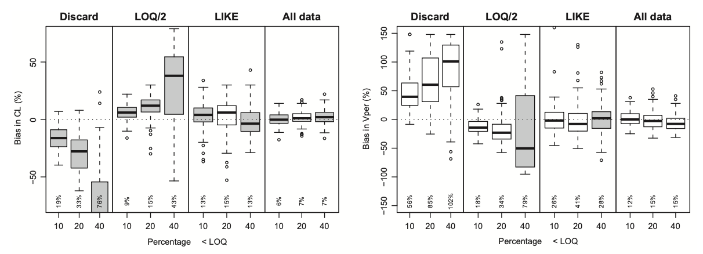{width="60%"} 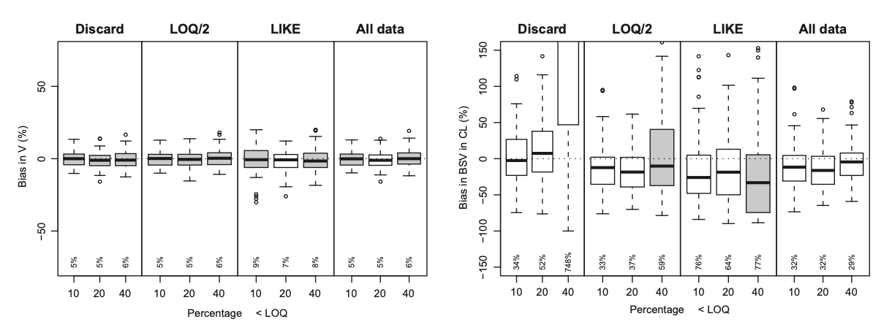{width="60%"}

## Consequencies of an inappropriate handling of BLQ: Incorrect model selection[^8]

[^8]: Wonkyung Byon, et al., JPKPD, 2008

::: columns
::: {.column width="50%"}
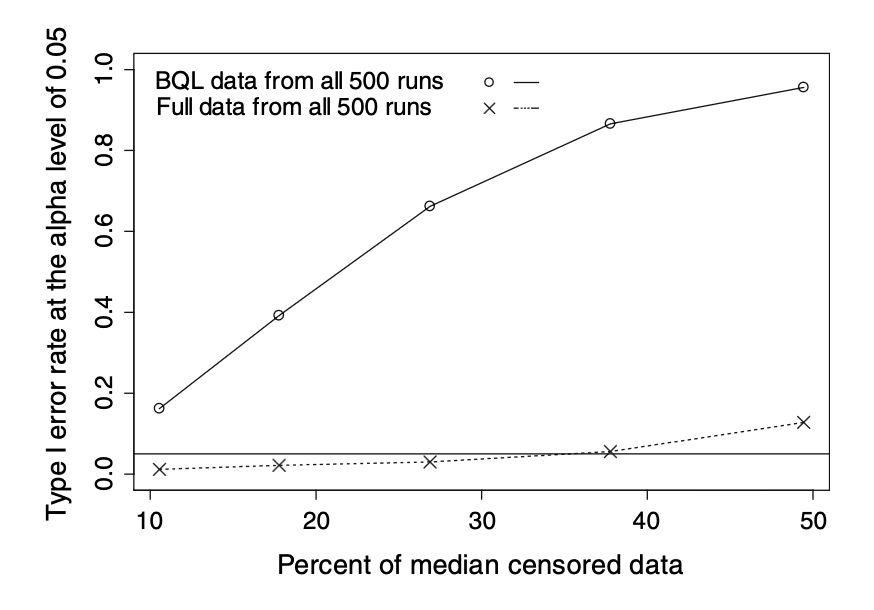{width="100%"}
:::

::: {.column width="50%"}
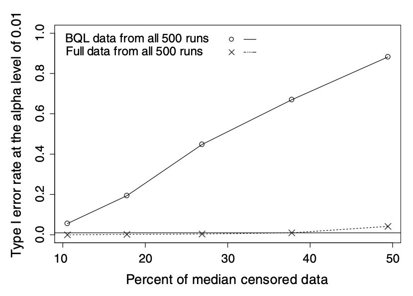{width="100%"}
:::
:::

# Implementation of BLQ methods

## Implementations in NONMEM: Original model

``` bash
...

$INPUT C NUM ID TIME AMT CMT EVID DV BLQ LLOQ AGE SEX ALB SCR WT HT GENO BSA EGFR DOSE

$DATA "../../data/nmdat1.csv" IGNORE=(C='C', BLQ=1) ; M1, ignore BLQ

$SUBROUTINES ADVAN4 TRANS4 ; 2-cpt oral

...

$ERROR
IPRED = F
Y = IPRED*(1+EPS(1))

...
$THETA
(0, 2.9786) ; CL
(0, 71.033) ; V
(0, 6)      ; Q
(0, 70)     ; V3
(0, 2.2780) ; KA

...

$SIGMA 
0.13733 ; Prop Err

...

$EST METHOD=1 INTERACTION MAXEVAL=9999 NSIG=3 SIGL=9 PRINT=1 MSF=./001.msf

...
```

## General implementations: Original model

Minimization of extended least square (ELS):

$$
-2logl(y_{ij})=log(2\pi g(t)) + \frac{(y_{ij}-f_{ij})^2}{g(t)}
$$

Additive error model:

$$
g(t) = \sigma^2
$$

Proportional error model:

$$
g(t) = f(t)^2 \times \sigma^2
$$

Combined error model:

$$
g(t) = \sigma_1^2+f(t)^2 \times \sigma_2^2
$$

## Implementations in NONMEM: M2[^9]

[^9]: Nick Holford, Missing Data – Left Censoring: The BLQ Problem

``` {.bash code-line-numbers="1,11,30"}
$INPUT C NUM ID TIME AMT CMT EVID DV BLQ LLOQ AGE SEX ALB SCR WT HT GENO BSA EGFR DOSE
...

$DATA "../../data/nmdat1.csv" IGNORE=(C='C', BLQ=1) ; M2, still ignore BLQ

$SUBROUTINES ADVAN4 TRANS4 ; 2-cpt oral

...

$ERROR
YLO=LLOQ
IPRED = F
Y = IPRED*(1+EPS(1))

...
$THETA
(0, 2.9786) ; CL
(0, 71.033) ; V
(0, 6)      ; Q
(0, 70)     ; V3
(0, 2.2780) ; KA

...

$SIGMA 
0.13733 ; Prop Err

...

$EST METHOD=1 LAPLACIAN INTERACTION MAXEVAL=9999 NSIG=3 SIGL=9 PRINT=1 MSF=./001.msf

...
```

## General implementations: M2[^10]

[^10]: Stuart L. Beal, JPKPD, 2001

-   Minimization of extended least square (ELS) in original model:

$$
-2logl(y_{ij})=log(2\pi g(t)) + \frac{(y_{ij}-f_{ij})^2}{g(t)} 
$$ - Minimization of extended least square (ELS) conditioning on the probability that the concentration is greater than LLOQ (i.e., YLO):

$$
-2logl(y_{ij} | y_{ij}>YLO)=log(2\pi g(t)) + \frac{(y_{ij}-f_{ij})^2}{g(t)} + 2log(1-\Phi(\frac{YLO-f_{ij}}{\sqrt{g(t)}}))
$$

## Implementations in NONMEM: M3[^11]

[^11]: Mutaz Jaber, CPT:PSP, 2021

::: columns
::: {.column width="50%"}
``` {.bash code-line-numbers="1,2,4,10-26"}
$INPUT C NUM ID TIME AMT CMT EVID DV BLQ LLOQ AGE 
       SEX ALB SCR WT HT GENO BSA EGFR DOSE
...
$DATA "../../data/nmdat1.csv" IGNORE=(C='C') ; M3, include BLQ
$SUBROUTINES ADVAN4 TRANS4 ; 2-cpt oral
...
$ERROR
IPRED = F

RUVCV=THETA(6)
RUVSD=THETA(7)
PROP=IPRED*RUVCV
ADD=RUVSD
SD=SQRT(PROP*PROP+ADD*ADD)

IF (BLQ.EQ.0) THEN
  F_FLAG=0 ; ELS
  Y=IPRED + SD*EPS(1)
ELSE
  F_FLAG=1 ; LIKELIHOOD
  CUMD=PHI((LLOQ-IPRED)/SD)
  Y=CUMD
  MDVRES=1
ENDIF

IF(COMACT.EQ.1) PREDV=IPRED
...
```
:::

::: {.column width="50%"}
``` {.bash code-line-numbers="8-9,11-12,14-16"}
...
$THETA
(0, 2.9786) ; CL
(0, 71.033) ; V
(0, 6)      ; Q
(0, 70)     ; V3
(0, 2.2780) ; KA
(0, 0.3)    ; RUVCV
(0, 0.01)   ; RUVSD
...
$SIGMA 
1 FIX       ; Prop Err variance fixed
...
$EST METHOD=1 LAPLACIAN INTERACTION MAXEVAL=9999 
     NSIG=3 SIGL=9 PRINT=1 MSF=./001.msf
$TABLE ...PREDV...
...
```
:::
:::

## General implementations: M3

-   For concentrations above LLOQ: treated as continuous outcome, optimized using ELS:

$$
-2logl(y_{ij})=log(2\pi g(t)) + \frac{(y_{ij}-f_{ij})^2}{g(t)} 
$$

-   For concentrations BLQ: treated as categorical outcome, optimization the probability less than LLOQ:

$$
P(y_{ij}<LLOQ)=\Phi(\frac{LLOQ-f_{ij}}{\sqrt{g(t)}})
$$

## General implementations: M3

```{r}
suppressPackageStartupMessages(library(tidyverse))

# choose the cutoff
z0 <- 1

# data for normal curve
df <- data.frame(x = seq(-10, 30, length.out = 1000))
df$y <- dnorm(df$x,mean=10, sd=5)

# shaded area: P(Z < z0)
df_fill <- subset(df, x < z0)

ggplot(df, aes(x, y)) +
  geom_area(data = df_fill, fill = "#E67E52", alpha = 0.95) +
  geom_line(linewidth = 1) +
  geom_vline(xintercept = z0, linewidth = 1) +
  annotate("text", x = z0 - 4, y = dnorm(z0, mean=10, sd=5) + 0.03,
           label = paste0("LLOQ = ", z0), size = 5) +
  scale_x_continuous(breaks = seq(-12,32,4), limits = c(-12, 32)) +
  # scale_y_continuous(expand = expansion(mult = c(0, 0.01))) +
  labs(
    x = "Concentrations",
    y = "Probability density",
    title = NULL,
    subtitle = paste0("Phi(", z0, ") = P(Z <= ", z0, ") = ",
                      round(pnorm(z0, mean=10, sd=5), 4))
  ) +
  theme_classic(base_size = 14) +
  theme(
    axis.text.y = element_blank(),
    axis.ticks.y = element_blank()
  )
```

## Implementations: M4[^12][^13]

[^12]: Nick Holford, Missing Data – Left Censoring: The BLQ Problem

[^13]: Mutaz Jaber, CPT:PSP, 2021

::: columns
::: {.column width="50%"}
``` {.bash code-line-numbers="1,2,4,10-27"}
$INPUT C NUM ID TIME AMT CMT EVID DV BLQ LLOQ AGE 
       SEX ALB SCR WT HT GENO BSA EGFR DOSE
...
$DATA "../../data/nmdat1.csv" IGNORE=(C='C') ; M4, include BLQ
$SUBROUTINES ADVAN4 TRANS4 ; 2-cpt oral
...
$ERROR
IPRED = F

RUVCV=THETA(6)
RUVSD=THETA(7)
PROP=IPRED*RUVCV
ADD=RUVSD
SD=SQRT(PROP*PROP+ADD*ADD)

IF (BLQ.EQ.0) THEN
  F_FLAG=0 ; ELS
  Y=IPRED + SD*EPS(1)
ELSE
  F_FLAG=1 ; LIKELIHOOD
  CUMD=PHI((LLOQ-IPRED)/SD)
  CUMDZ=PHI(-IPRED/SD)
  Y=(CUMD-CUMDZ)/(1-CUMDZ)
  MDVRES=1
ENDIF

IF(COMACT.EQ.1) PREDV=IPRED
```
:::

::: {.column width="50%"}
``` {.bash code-line-numbers="8-9,11-12,14-16"}
...
$THETA
(0, 2.9786) ; CL
(0, 71.033) ; V
(0, 6)      ; Q
(0, 70)     ; V3
(0, 2.2780) ; KA
(0, 0.3)    ; RUVCV
(0, 0.01)   ; RUVSD
...
$SIGMA 
1 FIX       ; Prop Err variance fixed
...
$EST METHOD=1 LAPLACIAN INTERACTION MAXEVAL=9999 
     NSIG=3 SIGL=9 PRINT=1 MSF=./001.msf
$TABLE ...PREDV...
...
```
:::
:::

## General implementations: M4

For concentrations above LLOQ: treated as continuous outcome, optimized using ELS:

$$
-2logl(y_{ij})=log(2\pi g(t)) + \frac{(y_{ij}-f_{ij})^2}{g(t)} 
$$

For concentrations BLQ: treated as categorical outcome, optimization the probability less than LLOQ but greater than 0:

$$
P(0<y_{ij}<LLOQ)=\frac{\Phi(\frac{LLOQ-f_{ij}}{\sqrt{g(t)}})-\Phi(\frac{0-f_{ij}}{\sqrt{g(t)}})}{1-\Phi(\frac{0-f_{ij}}{\sqrt{g(t)}})}
$$

## General implementations: M4

```{r}
suppressPackageStartupMessages(library(tidyverse))

# choose the cutoff
z0 <- 1

# data for normal curve
df <- data.frame(x = seq(-10, 30, length.out = 1000))
df$y <- dnorm(df$x,mean=10, sd=5)

# shaded area: P(Z < z0)
df_fill <- subset(df, x < z0&x>0)
df_fill2 <- subset(df, x>0)

prob <- (pnorm(z0, mean=10, sd=5)-pnorm(0, mean=10, sd=5))/(1-pnorm(0, mean=10, sd=5))

ggplot(df, aes(x, y)) +
  geom_area(data = df_fill, fill = "#E67E52", alpha = 0.95) +
  geom_area(data = df_fill2, fill = "navy", alpha = 0.15) +
  geom_line(linewidth = 1) +
  geom_vline(xintercept = 0, linewidth = 1) +
  geom_vline(xintercept = z0, linewidth = 1) +
  annotate("text", x = z0 - 4, y = dnorm(z0, mean=10, sd=5) + 0.03,
           label = paste0("LLOQ = ", z0), size = 5) +
  scale_x_continuous(breaks = seq(-12,32,4), limits = c(-12, 32)) +
  # scale_y_continuous(expand = expansion(mult = c(0, 0.01))) +
  labs(
    x = "Concentrations",
    y = "Probability density",
    title = NULL,
    subtitle = paste0("(Phi(", z0, ")-Phi(0)) / (1-Phi(0))= P(0 < Z <= ", z0, "| Z>0) = ",
                      round(prob, 4))
  ) +
  theme_classic(base_size = 14) +
  theme(
    axis.text.y = element_blank(),
    axis.ticks.y = element_blank()
  )
```

## Issues of M4 method

-   Although a concentration has to be $\geq$ 0, its corresponding measurement can be $\lt$ 0 depends on the accuracy and precision of the bioanalytical assay[^14].
-   Therefore, the assumption of M4, a BLQ measurement is lower than LLOQ but greater than 0, is not completely valid.

[^14]: https://www.reddit.com/r/CHROMATOGRAPHY/comments/11ktvpp/negative_intercept_in_calibration_curves/

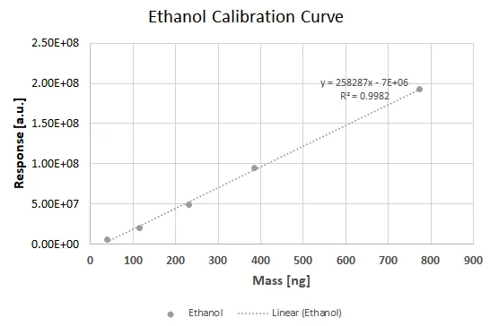

## M5, M6, M7[^15]

[^15]: James R. Johnson. 2018

::: columns
::: {.column width="30%"}
-   M1: Ignore all BLQ values.
-   M5: Include all BLQ values.
-   M6: Include only the first BLQ value in a sequence.
-   M7: Include all BLQ values.
:::

::: {.column width="70%"}
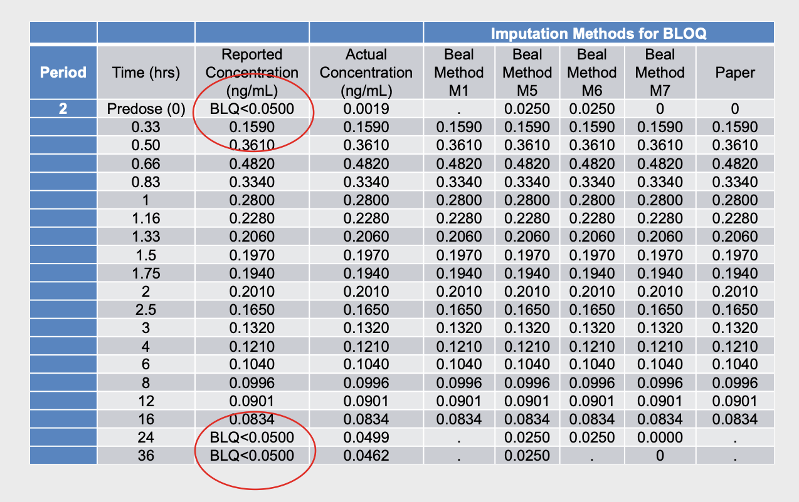{width="100%"}
:::
:::

# New methods to handle BLQ

## M6+, M7+[^16]

[^16]: Wijk, M., et al., CPT:PSP, 2025

-   M3 method has become the "gold standard" for handling BLQ values in practice.
-   However, it is frequently increase model instability when implement:
    -   Model unable to converge.
    -   Failed covariance step.
    -   Variance-covariance matrix issues: large condition number.
-   M6+ and M7+ were recently developed to:
    -   Mitigate M3 method induced model instability.
    -   With only slightly increased bias in parameter estimates than M3, but decreased bias than M1, M6 and M7.

## M6+, M7+[^17]

[^17]: Wijk, M., et al., CPT:PSP, 2025

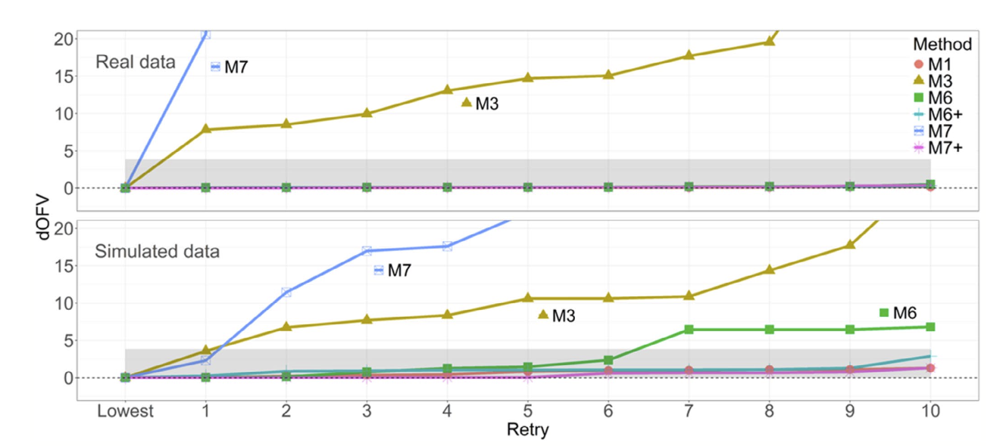{width="80%"}

## M6+, M7+[^18]

[^18]: Wijk, M., et al., CPT:PSP, 2025

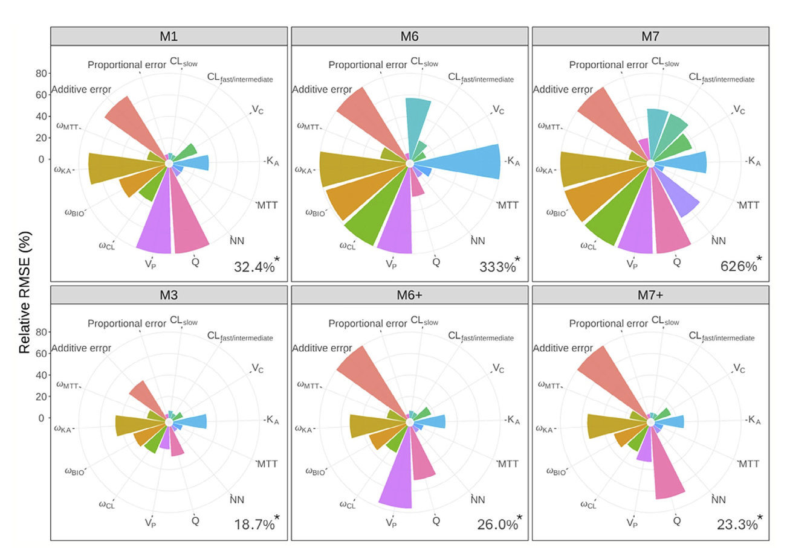{width="80%"}

## M6+, M7+ Implementations[^19]

[^19]: Wijk, M., et al., CPT:PSP, 2025

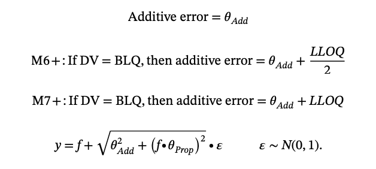{width="60%"}

## M6+ Implementations in NONMEM[^20]

[^20]: Wijk, M., et al., CPT:PSP, 2025

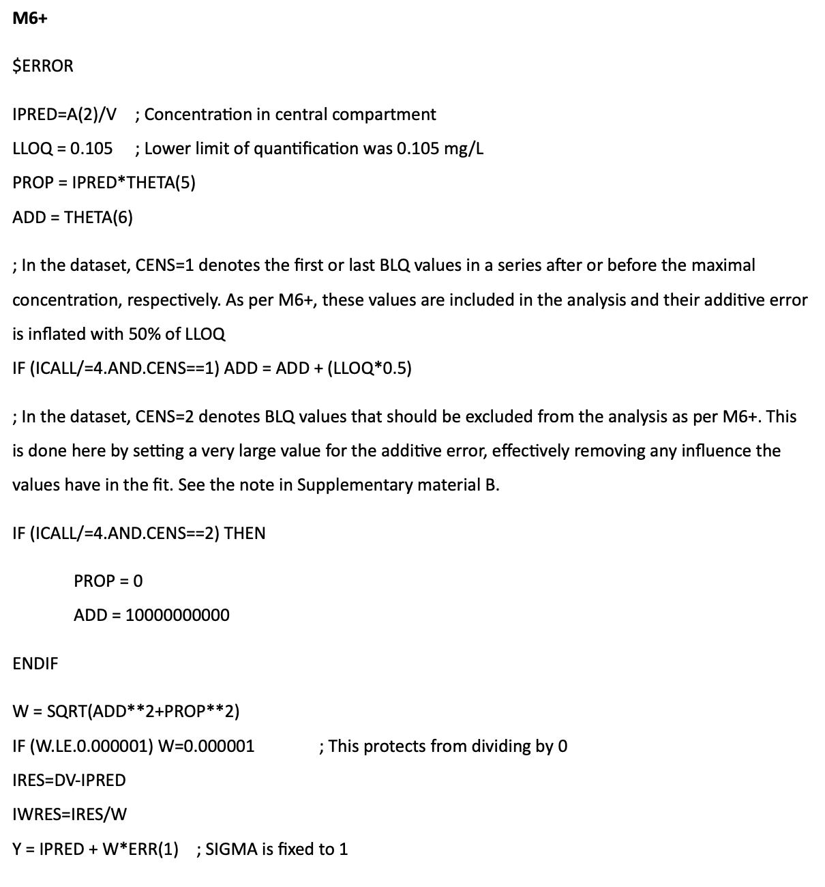{width="50%"}

## M7+ Implementations in NONMEM[^21]

[^21]: Wijk, M., et al., CPT:PSP, 2025

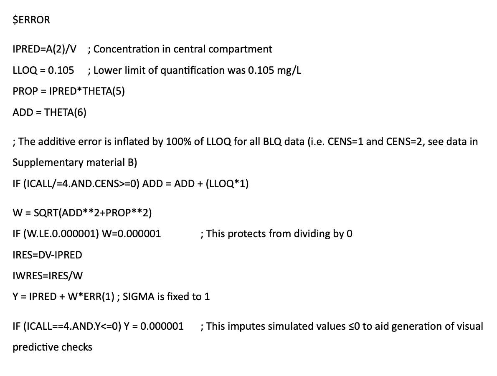{width="50%"}

# Above upper limit of quantification

## ULOQ[^22]

[^22]: Kristjansdottir, Kolbrun et al., 2012

::: columns
::: {.column width="50%"}

:::

::: {.column width="50%"}
-   The signal intensity of bioanalytical assay should be proportional to the amounts in the sample.

-   However, this relationship is only linear over a certain range.

-   The lower and upper boundaries of the range are refer to as:

    -   Lower limit of quantification (LLOQ).

    -   Upper limit of quantification (ULOQ).
:::
:::

## ALQ

-   Let's refer to above ULOQ as ALQ for now.
-   ALQ is also known as right censoring.

```{r}
#| warning: false
suppressPackageStartupMessages(library(tidyverse))
suppressPackageStartupMessages(library(patchwork))
theme_set(theme_bw())

data <- data.frame(conc=rnorm(n=1000, mean=10, sd=5)) %>% 
  mutate(conc2=ifelse(conc<20, conc, NA_real_))

p1 <- ggplot(data)+geom_histogram(aes(x=conc), bins=30, alpha=0, color="black")+
  xlab("Concentrations")+ylab("Density")+ggtitle("Within LQ")
p2 <- ggplot(data)+geom_histogram(aes(x=conc2), bins=30, alpha=0, color="black")+
  xlab("Concentrations")+ylab("Density")+ggtitle("ALQ")
p1+p2
```

-   Similar to BLQ, ALQ is also an indicator/flag type of variable, for example:
    -   ALQ=0, if a concentration $\leq$ ULOQ.
    -   ALQ=1, if a concentration $\gt$ LLOQ.

## ALQ

-   ALQ is generally less frequently to encounter using routine bioanalytical methods (e.g., LC/MS).
    -   We can always dilute the samples to let their concentrations fall under the linear range of a calibration curve.
-   Examples for ALQ:
    -   Very high concentration in a sample taken
        -   Immediately after dose.
        -   During infusion.
        -   During extreme accumulation in the course of overdose or impaired clearance.
    -   Limited sample size paired with sample instability after dilution.
    -   Ligand binding assay (LBA) for high concentration biologics.
    -   Assay *in vivo* with saturable signal, such as *in vivo* imaging or bioluminescent assay to assess tumor size.

## YUP {style="font-size: 1em"}

-   Similar as YLO, a YUP option is also available in NONMEM to specify ULOQ in NONMEM (M2).

-   Ignore BLQ measurements, specifying a YUP will allow the likelihood calculation conditioning all measurable concentrations being below ULOQ.

## Implementation in NONMEM: M3

::: columns
::: {.column width="50%"}
``` {.bash code-line-numbers="1,2,4,10-26"}
$INPUT C NUM ID TIME AMT CMT EVID DV ALQ ULOQ AGE 
       SEX ALB SCR WT HT GENO BSA EGFR DOSE
...
$DATA "../../data/nmdat1.csv" IGNORE=(C='C') ; M3, include ALQ
$SUBROUTINES ADVAN4 TRANS4 ; 2-cpt oral
...
$ERROR
IPRED = F

RUVCV=THETA(6)
RUVSD=THETA(7)
PROP=IPRED*RUVCV
ADD=RUVSD
SD=SQRT(PROP*PROP+ADD*ADD)

IF (ALQ.EQ.0) THEN
  F_FLAG=0 ; ELS
  Y=IPRED + SD*EPS(1)
ELSE
  F_FLAG=1 ; LIKELIHOOD
  CUMD=1-PHI((LLOQ-IPRED)/SD)
  Y=CUMD
  MDVRES=1
ENDIF

IF(COMACT.EQ.1) PREDV=IPRED
...
```
:::

::: {.column width="50%"}
``` {.bash code-line-numbers="8-9,11-12,14-16"}
...
$THETA
(0, 2.9786) ; CL
(0, 71.033) ; V
(0, 6)      ; Q
(0, 70)     ; V3
(0, 2.2780) ; KA
(0, 0.3)    ; RUVCV
(0, 0.01)   ; RUVSD
...
$SIGMA 
1 FIX       ; Prop Err variance fixed
...
$EST METHOD=1 LAPLACIAN INTERACTION MAXEVAL=9999 
     NSIG=3 SIGL=9 PRINT=1 MSF=./001.msf
$TABLE ...PREDV...
...
```
:::
:::

## General implementations: M3

-   For concentrations below ULOQ: treated as continuous outcome, optimized using ELS:

$$
-2logl(y_{ij})=log(2\pi g(t)) + \frac{(y_{ij}-f_{ij})^2}{g(t)} 
$$

-   For concentrations ALQ: treated as categorical outcome, optimization the probability greater than LLOQ:

$$
P(y_{ij}>ULOQ)=1-\Phi(\frac{ULOQ-f_{ij}}{\sqrt{g(t)}})
$$

## General implementations: M3

```{r}
suppressPackageStartupMessages(library(tidyverse))

# choose the cutoff
z0 <- 20

# data for normal curve
df <- data.frame(x = seq(-10, 30, length.out = 1000))
df$y <- dnorm(df$x,mean=10, sd=5)

# shaded area: P(Z < z0)
df_fill <- subset(df, x > z0)

ggplot(df, aes(x, y)) +
  geom_area(data = df_fill, fill = "#E67E52", alpha = 0.95) +
  geom_line(linewidth = 1) +
  geom_vline(xintercept = z0, linewidth = 1) +
  annotate("text", x = z0 + 4, y = dnorm(z0, mean=10, sd=5) + 0.03,
           label = paste0("LLOQ = ", z0), size = 5) +
  scale_x_continuous(breaks = seq(-12,32,4), limits = c(-12, 32)) +
  # scale_y_continuous(expand = expansion(mult = c(0, 0.01))) +
  labs(
    x = "Concentrations",
    y = "Probability density",
    title = NULL,
    subtitle = paste0("Phi(", z0, ") = P(Z >= ", z0, ") = ",
                      round(1-pnorm(z0, mean=10, sd=5), 4))
  ) +
  theme_classic(base_size = 14) +
  theme(
    axis.text.y = element_blank(),
    axis.ticks.y = element_blank()
  )
```

# Model evaluations

## CWRES vs. NPDE[^23]

[^23]: Thanh Bach, et al., Antimicrob Agents Chemother., 2021

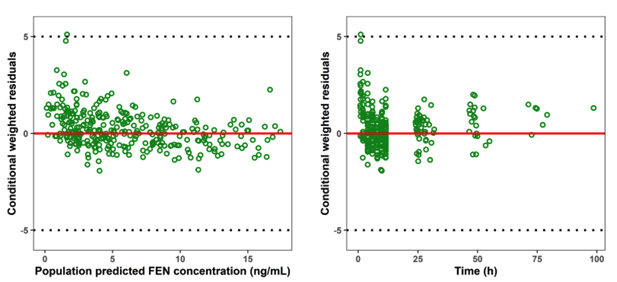{width="50%"} 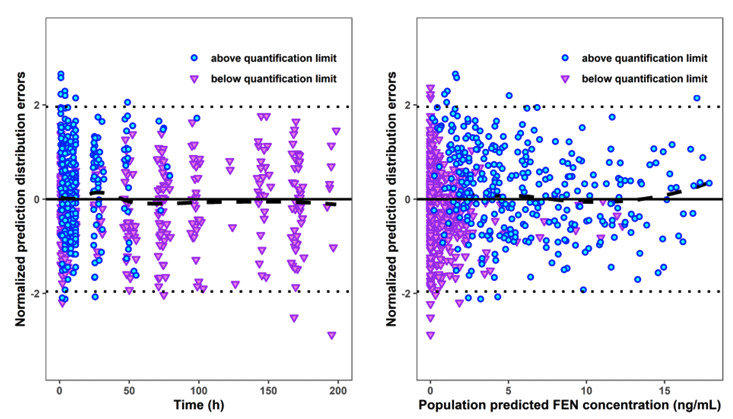{width="50%"}

## Predictive checks[^24]

[^24]: Martin Bergstrand and Mats O. Karlsson. AAPS J., 2009

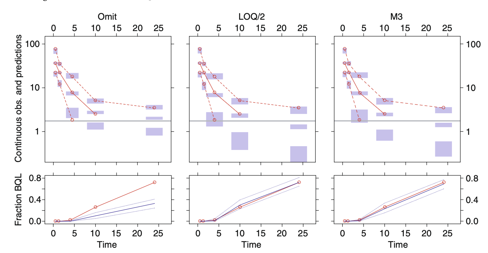{width="50%"} 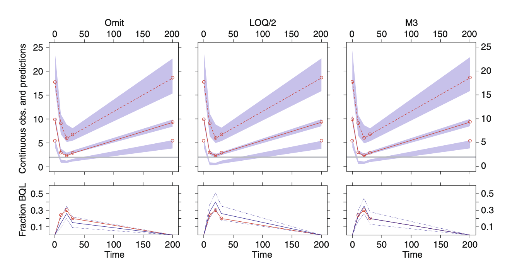{width="50%"}

# Practical suggestions

## Practical suggestions

-   Measurements BLQ/ALQ are useful, although less informative.
    -   Should be incorporated to inform model development when possible.
    -   Always communicate with biochemists to keep records of BLQs.
-   When BLQ/ALQ percentage is low ($\lt$ 5%), or BLQ/ALQ position is less critical given a model:
    -   M1 method can be useful
    -   M5 and M6 may also be good options.
-   When BLQ/ALQ percentage is high ($\gt$ 10%), or BLQ/ALQ position is critical given a model:
    -   When timing of BLQ/ALQ samples are available:
        -   M3 method is the "gold standard".
        -   When M3/M4 methods become unstable, M6, M7, M6+ and M7+ may be good alternatives.
    -   When timing of BLQ/ALQ samples are not available:
        -   M2 method should be attempted.
-   The M7 method was criticized a lot, if not the most.
-   Predictive checks of fraction of BLQ/ALQ are important model evaluation tools for assessing model performance in the presence of measurements $\lt$ LLOQ/ $\gt$ ULOQ.
