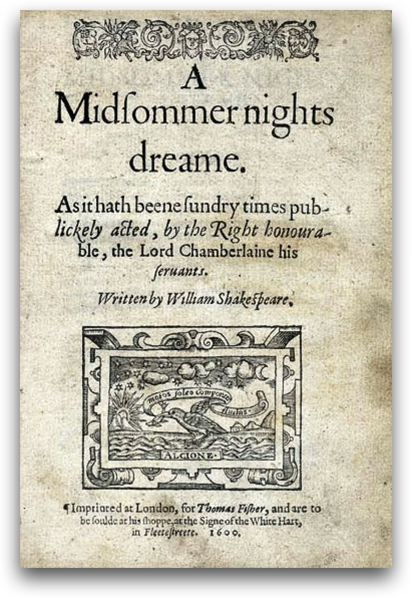
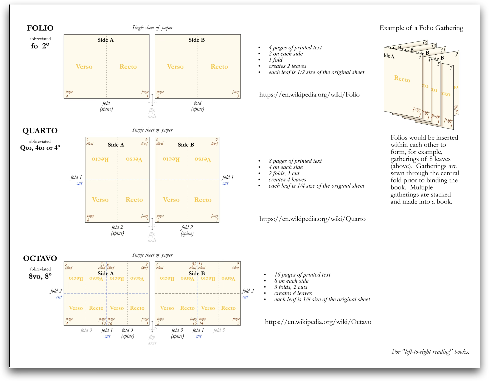
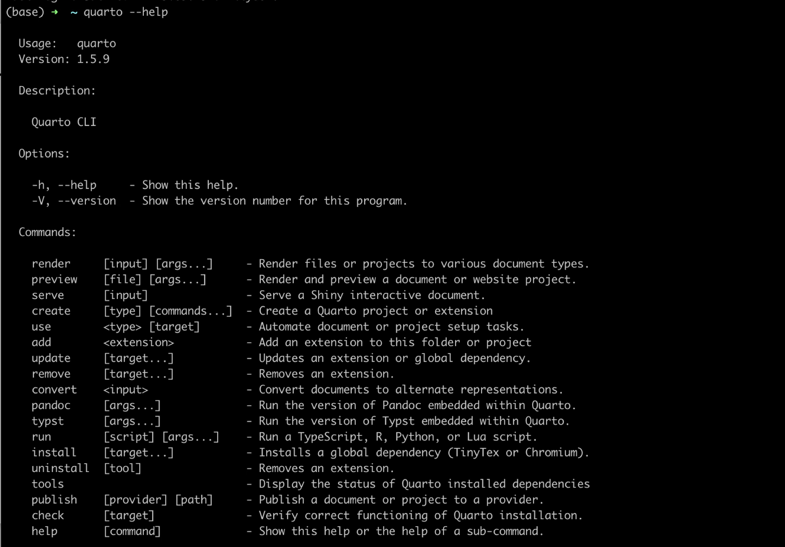

---
title: Introduction to Quarto
author: Mutaz Jaber, PharmD, PhD 
format:
    html:
        toc: true
--- 

```{r}
#| echo: false 
x <- 1
```

## 

::: {.callout-note}

## Reality of pharmacometric/quantitative analysis projects

- The modeling and quantitative analysis is done! Getting it into a reviwere-ready document takes a lot of effort (sometimes more than the modeling itself!)

- Formating Tables, Figures and listings are usually under-estimated

- What is your usual way of moving from model to document ready for review? 

::: 

## Litreate programming 

Literate programming is a methodology that combines a programming language with a documentation language, thereby making programs more robust, more portable, more easily maintained, and arguably more fun to write than programs that are written only in a high-level language.


::: {.callout-note}

Beyond documentation, literate programming offers benefits in education, research, and various technical domains. Examples? 

:::

## Hello, Quarto! 

::: {#fig-elephants layout-ncol=2}

{#fig-shake width=50%}

{#fig-quarto}

History
:::

## What is Quarto? 

It is an open-source scientific and technical publishing system

You can weave together narrative and code to produce elegantly formatted output such as documents, web pages, blog posts, books, dashboards, and more


## Why Quarto? 

- Multilingual and independent of computational systems
- Quarto comes “batteries included” straight out of the box
- Consistent expression for core features
- Extension system
- Enable “single-source publishing” — create Word, **PDFs**, **HTML**, etc. from one source
Use defaults that meet accessibility guidelines

## The Mechanistic Model (under the hood)


The goal of Quarto is to make the process of creating and collaborating on scientific and technical documents dramatically better. Quarto combines the functionality of R Markdown, bookdown, distill, xaringian, etc into a single consistent system with “batteries included” that reflects everything we’ve learned from R Markdown over the past 10 years.

## How it works? 

__Quarto is a command line (CLI) interface!__

:::: {.columns}

::: {.column width="40%"}

<br>

Quarto is a command line interface (CLI) that renders plain text formats into human readable/shareable formats
:::

::: {.column width="60%"}

:::

::::


```{bash}
quarto --help
```

## Basic Usage: document anatomy

Three main component of every Quarto document:

1. YAML: Defining the metadata
2. Text/Figures/Tables: Your input 
3. Code chunks 

### YAML: An overview

-   The YAML Header is marked by the three dashes `---`
-   The general principle is to have: the name of a data item (a key), followed by a colon, a space, and then the data item's value. A key-value pair in the format [key: value]{style="color: blue;"}.
-   Each line in YAML is a new item.
-   Dashes (`-`) represent individual items in a list.
-   Note that indentations matter in YAML!!
-   YAML can be used to specify the global settings for your document (i.e. figure caption location, citation method, code folding, etc.).
-   You can use the tab key to see what options are available

```{yaml}
#| echo: true
#| code-fold: false
#| code-summary: "expand for full code"

title: "Your HTML"
author: Add Your Name Here
date: "November 4, 2023"
format: html
cap-location: top
fig-format: png
```

For more infomation see: <https://quarto.org/docs/reference/formats/pdf.html>

### Text 

Markdown is a lightweight language for creating formatted text
Quarto is based on Pandoc and uses its variation of markdown as its underlying document syntax

For more infomation see: <https://quarto.org/docs/authoring/markdown-basics.html>

## Code Chunks

Code chunks begin and end with three backticks (usually) and are identified with a programming language in between `{}`

```{{r}}
library(ggplot2)
ggplot(Theoph, aes(Time, conc, group=Subject)) + 
  geom_line()
```

For more information see: <https://quarto.org/docs/computations/execution-options.html>

## Try this out:

1. Open your Positron IDE
2. Click New --> New File --> New Quarto Document
3. Render/Preview the file

