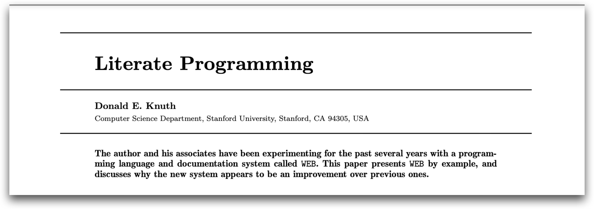
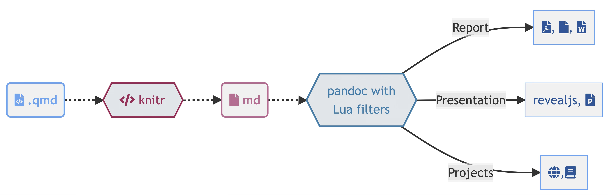

- We use powerful computational tools for our analyses every day. But when it comes time to assemble the results, we go back ages! 

- copy-pasting into Word, reformatting tables by hand, chasing down the right version. Each manual step introduces its own uncertainty: a mislabeled figure, a transposed number, a stale table from the wrong run. 

- These errors propagate — one wrong value in an early step can cascade through the entire document undetected. The same programmatic thinking we apply to modeling can transform how we write reports.

## The Pharmacometric Analysis Lifecycle


A general workflow in your analysis and working project can follow a cycle: 

```
Study Design → Data Assembly → Modeling → Simulation → [Reporting] → Publication → Review
```

Your audience: reviewers, collaborators, committees only sees the final document. Everything else is **invisible**


::: {.callout-note}

## Reality of pharmacometric/quantitative analysis projects
The **report** is the bridge between your analysis and the people who evaluate it. 

- Formating Tables, Figures and listings are usually under-estimated. 
- What is your usual way of moving from model to document ready for review? 

::: 

---


## The Reporting Reality

 Most quantitatve/PMx reporting follows a fragmented pipeline with manual handoffs at every step. A disproportionate fraction of project time goes to report assembly rather than modeling.

::: {.callout-note appearance="minimal"}

Think about it: extracting parameters from NONMEM output, formatting tables in Excel, copying figures into Word, manually numbering cross-references, reconciling file versions across team members.

:::

**Discussion:** What does your current workflow from NONMEM to final report look like?

---

## Judge by Document Quality

Your readers, whether journal reviewers, thesis committees, or regulators, evaluate the science/outcome/results through the document. 

:::: {.columns}
::: {.column width="48%"}

###  ✓

- Consistent table formatting
- Clear figure provenance
- Traceable analysis trail (reproducability)
- Correct cross-references
:::

::: {.column width="48%"}
### ✗

- Mismatched run numbers in text vs. appendix
- Wrong study labels on figures
- Tables that don't reconcile
- Orphaned references
:::
::::

---

## Tables Are the Backbone

Tables are the backbone of every pharmacometrics report — and the most time-consuming to get right. Example @tbl-param: 

| Parameter | Estimate | RSE (%) | Bootstrap Median (95% CI) |
|:----------|:--------:|:-------:|:-------------------------:|
| CL (L/h) | 12.4 | 8.2 | 12.1 (10.5, 14.8) |
| Vc (L) | 45.6 | 11.3 | 44.9 (38.2, 53.1) |
| Vp (L) | 23.1 | 15.7 | 22.8 (17.4, 30.2) |
| Q (L/h) | 3.45 | 22.1 | 3.38 (2.11, 5.62) |
| Ka (1/h) | 0.87 | 18.4 | 0.85 (0.58, 1.24) |
| CL ~ WT | 0.75 | 25.3 | 0.73 (0.48, 1.02) |
| IIV CL (%CV) | 32.4 | 12.8 | 31.9 (26.1, 38.7) |
| Prop. res. (%) | 18.2 | 6.1 | 18.0 (16.4, 20.1) |

: Example PopPK parameter estimates table {#tbl-param .striped}

Manual approach: reformat every table by hand after each model update. **automated approach**: code generates the table — always current, always consistent.

---


## Literate Programming

> "Let us change our traditional attitude to the construction of programs: instead of imagining that our main task is to instruct a **computer** what to do, let us concentrate rather on explaining to **human beings** what we want a computer to do."
>
> — Donald Knuth, 1984

Literate programming is a methodology that combines a programming language with a documentation language, thereby making programs more robust, more portable, more easily maintained, and arguably more fun to write than programs that are written only in a high-level language.




| Year | Tool | Idea |
|:-----|:-----|:-----|
| 1984 | Knuth's WEB | Interleave documentation and code in one file |
| 2022 | Quarto | Language-agnostic, multi-format, built for publishing |


::: {.callout-note}

Beyond documentation, literate programming offers benefits in education, research, and various technical domains. Examples? 

:::

---

## Hello, Quarto! 

::: {#fig-elephants layout-ncol=2}

{#fig-shake width=50%}

{#fig-quarto}

History
:::

## What is Quarto? 

It is an open-source scientific and technical publishing system <https://quarto.org> 

You can weave together narrative and code to produce elegantly formatted output such as documents, web pages, blog posts, books, dashboards, and more


## Why Quarto? 

- Multilingual and independent of computational systems
- Quarto comes “batteries included” straight out of the box
- Consistent expression for core features
- Extension system
- Enable “single-source publishing” — create Word, **PDFs**, **HTML**, etc. from one source
Use defaults that meet accessibility guidelines

---

## The Mechanistic Model (under the hood)



The goal of Quarto is to make the process of creating and collaborating on scientific and technical documents dramatically better. Quarto combines the functionality of R Markdown, bookdown, distill, xaringian, etc into a single consistent system with “batteries included” that reflects everything we’ve learned from R Markdown over the past 10 years.

---

## How it works? 

__Quarto is a command line (CLI) interface!__


Quarto is a command line interface (CLI) that renders plain text formats into human readable/shareable formats4

```{bash}
quarto --help
```

---

## Basic Usage: document anatomy

Three main component of every Quarto document:

1. YAML: Defining the metadata
2. Text/Figures/Tables: Your input 
3. Code chunks 

### YAML: An overview

-   The YAML Header is marked by the three dashes `---`
-   The general principle is to have: the name of a data item (a key), followed by a colon, a space, and then the data item's value. A key-value pair in the format [key: value]{style="color: blue;"}.
-   Each line in YAML is a new item.
-   Dashes (`-`) represent individual items in a list.
-   Note that indentations matter in YAML!!
-   YAML can be used to specify the global settings for your document (i.e. figure caption location, citation method, code folding, etc.).
-   You can use the tab key to see what options are available

```{yaml}
#| echo: true
#| code-fold: false
#| code-summary: "expand for full code"

title: "Your HTML"
author: Add Your Name Here
date: "November 4, 2023"
format: html
cap-location: top
fig-format: png
```

For more infomation see: <https://quarto.org/docs/reference/formats/pdf.html>

### Text 

Markdown is a lightweight language for creating formatted text
Quarto is based on Pandoc and uses its variation of markdown as its underlying document syntax

For more infomation see: <https://quarto.org/docs/authoring/markdown-basics.html>

## Code Chunks

Code chunks begin and end with three backticks (usually) and are identified with a programming language in between `{}`

```{{r}}
library(ggplot2)
ggplot(Theoph, aes(Time, conc, group=Subject)) + 
  geom_line()

# Code Chunk comment

x <- 1 
function(x) x^2 
```

For more information see: <https://quarto.org/docs/computations/execution-options.html>


---


## Figures

Different ways to deal with figures depending on the format and storage. It can be:

- Internal Figure: Using code chunks to generate graphics e.g., using ggplot2, pmplots, etc. 
- External Figure: Sourced from png, pdf, etc. 

For more info <https://quarto.org/docs/authoring/figures.html> 

### Internal Figures 

```{r}
#| echo: fenced
#| eval: true
#| label: fig-pk
#| fig-width: 10
#| fig-cap: this is the caption
#| output-location: column-fragment

library(ggplot2)

pk.profile <- ggplot(Theoph, aes(x=Time, y=conc)) + 
    geom_point(color="blue", 
               alpha=0.6)

pk.profile
```

The `#| label` option is how the figure is identified when you cross reference it. To cross reference the figure in text type `@label`

-   @fig-pk is my first Figure 

-   The "fig-cap" is the figure's title

-   Other options: <https://quarto.org/docs/authoring/figures.html>

---

## Tables 

Internal tables are generated inline from R code chunks. The code runs on render and the table appears in the document automatically:


Same as figures, we can separate table listings into internal (inline) and external (file e.g. *.tex, *.html)

```{{r}}
#| label: tbl-params
#| tbl-cap: Parameter Estimates Generated Using R/bbr/pm ecosystem

library(bbr)
library(pmparams)
library(pmtables)

model_dir <- system.file("model/nonmem", package = "pmparams")
paramKey <- file.path(model_dir, "pk-parameter-key-new.yaml")
yaml::yaml.load_file(paramKey) %>% unlist() %>% head()

mod <- bbr::read_model(file.path(model_dir, "102"))
sum   <- model_summary(mod) |> param_estimates()

param_df <- mod %>% 
  define_param_table(.key = paramKey) %>% 
  format_param_table(.cleanup_cols = TRUE, .digit = 3)

make_pmtable(param_df, .pmtype = "fixed") %>% 
  # abbreviations
  st_notes(footnote$ci, footnote$se) %>% 
  st_notes_str() %>% 
  # equations
  st_notes(footnote$ciEq) %>%
  # file
  st_files(output = "deliv/final-param-fixed-ci-95.tex")

tab_fixed_out <- tab_fixed %>% 
  stable()

```

Model updated? Change run number and yaml -> `quarto render`. Done! 


External tables are pre-built (e.tex files that you include directly): useful when the table is generated by a separate pipeline or shared across reports. 

::: {.callout-note}

### When to use which
Internal tables keep everything self-contained — the table updates every time you render. External tables give you flexibility when the source lives outside the document or comes from a validated process. Most reports use a mix of both.
:::
---

## Extensions and Templates 

Quarto Extensions are a powerful way to modify and extend the behavior of Quarto. 

- With an extension, you define your formatting once:
fonts, margins, headers, page layout — and every document that uses it gets the same consistent look. 

- There are extensions for journal articles, regulatory submissions, theses, and conference posters. You can also build your own for your lab or organization.

